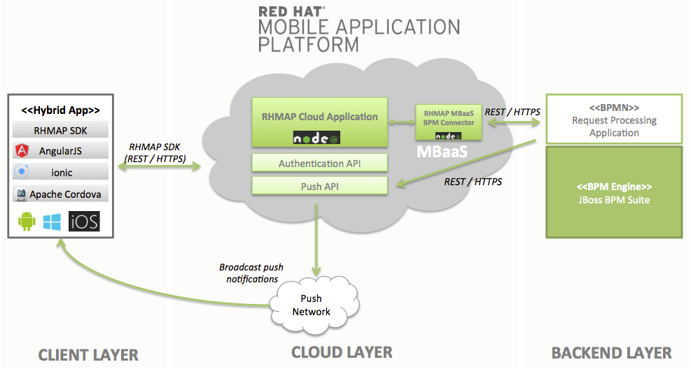

Showcase - Faster and more efficient processes by combining BPM and Mobile
======================================================================

A. Synopsis
===========

What this is about
------------------
A lot has happened in the area of mobile since Apple kicked off the revolution by announcing the first iPhone. However, the overall mobile market still has to be considered as young and especially unstandardized. This really puts a lot of organizations in front of huge challenges concerning the efficient development of mobile applications and the secure integration into backend IT systems.

But there is no way around mobile in the next years! The smart combination of mobile techniques (MBaaS, micro services, etc.) and business process management approaches will definitely drive process efficiency and speed to a whole new level.

#### The use case or "What if the process was at the fingertips of your customer?"
This showcase addresses a scenario that almost all enterprises in the insurance industry are facing: nowadays users expect to be able to contact their insurance 24/7 on an ad-hoc basis (e.g. for opening a claim or just for asking a question concerning their policy). Additionally they want to see on demand what the status of a certain request is. From an enterprise point of view insurances are looking at new ways on reacting to this new speed of communication and transparency. They're also thinking of new concepts to efficiently integrate agencies and remote workers in their existing processes. They key consequence to address these requirements is to enhance existing input & output management infrastructure by a newly established mobile channel.

In this showcase we used Red Hat Mobile Application Platform ([https://www.redhat.com/en/technologies/mobile/application-platform](https://www.redhat.com/en/technologies/mobile/application-platform)) as a key building block to efficiently and securely connect the outside world with existing enterprise systems.

Through the platform approach we do not need to reinvent the wheel for each mobile app on the horizon. Instead we put in place a centralized platform for developing and running mobile application in a standardized manner.

The use of Red Hat Mobile Application Platform (RHMAP) comes with the following benefits:
* Agile approach to developing, integrating, and deploying enterprise mobile applications—whether native, hybrid, or on the web
* Out-of-the-box automated build processes (including build farm)
* A service catalog for reusable connectors to backends
* Easy scale-out through cloud native architecture
* Collaborative development across multiple teams and projects with a wide variety of leading tool kits and frameworks

Architectural overview
----------------------
From a technical point of view the showcase is comprised of three main building blocks:

* **CLIENT LAYER:** Hybrid mobile applications running on the end user devices
* **CLOUD LAYER:** Node.js based backend running in the cloud on RHMAP
* **BACKEND LAYER:** Set of business process applications running on [JBoss BPM Suite](https://www.redhat.com/en/technologies/jboss-middleware/bpm) as the underlying BPM engine

#### Client layer
Since we have two different user groups (external end customer and employees) we've decided to develop two separate applications:

* **Customer App:** This app is meant to be used by our end customers (using a broad range of different mobile devices) and has therefore being implemented especially with hybrid app development principles in mind. We chose Apache Cordova ([https://cordova.apache.org/](https://cordova.apache.org/)) as our core development framework, which enables us to build our app against all common mobile OS with only one code base ("develop once, run everywhere" principle). In terms of the UI and application framework we decided to go for a combination of ionic ([http://ionicframework.com/](http://ionicframework.com/)) and AngularJS ([https://angularjs.org/](https://angularjs.org/)). Both projects have a vibrant and active community and have been successfully adopted by many projects.

* **Employee App:** This app targets remote workers (such as insurance agencies e.g.) who shall work on our processes from remote. We've decided to go for the same hybrid app approach in order to share code and speed up development. However, for such an end user group where we might influence the use of certain device types (such as Apple iPhone) we could have also thought about a native app (RHMAP provides an SDK for all popular mobile OS; so we could also reuse existing backend functionality in our cloud layer).

The source code of both applications is hosted on RHMAP which allows us to make use of the built-in build farm (allowing us to create push button builds for iOS, Android et al), configure and also preview the application.

#### Cloud layer
The cloud part of an application built with RHMAP is comprised of a so called "Cloud Code App" providing the core functionality for our clients and a set of reusable MBaaS services that enable the connectivity to 3rd party (backend) systems. The following illustration shows an overview of all components created for our showcase:

##### Cloud code apps
For our showcase we've implemented a single Node.js based app called `Cloud App` which accepts all incoming requests from our client layer. RHMAP provides a feature rich development framework (including custom Node.js convenience modules) making the creation of cloud code apps easy and efficient. Through the use of Node.js as our programming language we get all the benefits of its evented and asynchronous model, that works extremely well with our use case of a data intense realtime application (DIRT paradigm).

##### MBaaS services (Mobile backend as a service)
An MBaaS (Mobile Backend-as-a-Service) is the primary point of contact for end user applications - both mobile and web. The MBaaS hosts Node.js applications - as REST API servers and/or Express.js based web apps. The primary purpose of the MBaaS is to allow users (developers) of RHMAP to deploy Node.js server-side for their mobile apps. The MBaaS also provides functionality such as caching, persistence, data synchronization and a range of other mobile-centric functionality. Multiple MBaaS may be utilized for customer segregation and/or lifecycle management (environments).

For this showcase we've developed a new MBaaS connector called `fh-connector-jbpm-cloud`, which is meant to be reused across multiple applications hosted on RHMAP. For the use in our project we've instantiated it and configured the environment variables to connect to our specific JBoss BPM Suite in the backend layer.

Function wise the MBaaS connector currently provides the following functionality:

* Process management
  * Start process
  * Get process instance
* Task management
  * Load tasks
  * Load task content
  * Claim task
  * Complete task
  * Release task
  * Start task

##### Push notifications
We make use of the RHMAP built-in mobile push API which provides a generic way to interface with multiple push networks (Google Cloud Messaging, Apple Push Notification Service and Microsoft Push Notification Service) via REST or Node.js. This makes it very convenient to send out push notifications from 3rd party application (such as JBoss BPM Suite as demonstrated in our showcase).

More information on the push API can be found here [http://docs.feedhenry.com/v3/product_features/push_notifications.html](http://docs.feedhenry.com/v3/product_features/push_notifications.html)

#### Backend layer
This layer is comprised of a large set of different backend systems that typically run inside the datacenter of an organization; such as application servers, databases, messaging systems or ESB-like services. For the sake of this showcase we've chosen JBoss BPM Suite (([https://www.redhat.com/en/technologies/jboss-middleware/bpm](https://www.redhat.com/en/technologies/jboss-middleware/bpm))) as the only system in here. The BPM Suite provides a full blown authoring and runtime environment for business process applications focused on the use of open standards (such as BPMN 2.0). The included BPM engine also exposes a rich REST API that is used extensively by our MBaaS connector `fh-connector-jbpm-cloud` to start new process instances, control the process flow etc.

##### Request processing application
The core business process for our scenario is implemented as a simple BPMN 2.0 workflow that is being deployed in form of our Java based `Request Processing Application`.

After being instantiated the process firstly sends out a push notification to the requesting customer by simply calling the [RHMAP push API](https://sa-jboss-dach.redhat.feedhenry.com/docs/api/api_push.html). Secondly a human task called `Process request` is used to create a new work item in the work basket of our employees. Through our `Employee App` mobile application we empower remote employees to directly work on the request.

In addition to that the work items can be claimed via a traditional web-based application named  Business Central, that is provided as part of JBoss BPM Suite.

Based on the decision the process completes with an according push notification to inform the customer.

More information on how to develop process applications can be found in the  [JBoss BPM Suite Development Guide](https://access.redhat.com/documentation/en-US/Red_Hat_JBoss_BPM_Suite/6.3/html-single/Development_Guide/index.html).

B. Walkthrough
==============

1. Customer creates new request
-------------------------------

2. a) Employee works on request
-------------------------------

3. b) Agency / Remote worker completes
--------------------------------------
TBD

4. Customer receives push updates on current status
--------------------------------------

C. Reference Information
========================

Source code
-----------
The source code can be found here:
#### Client layer
* [Hybrid Customer App](https://github.com/Sifa91/fh-mobile-bpm-client-customer)
* [Hybrid Client App](https://github.com/Sifa91/fh-mobile-bpm-client-employee)

#### Cloud layer
* [RHMAP Cloud Application](https://github.com/sebastianfaulhaber/fh-mobile-bpm-cloudapp)
* [RHMAP MBaas BPM Connector](https://github.com/sebastianfaulhaber/fh-connector-bpm)

#### Backend layer
* [JBoss BPM Suite Request Processing Application](https://github.com/sebastianfaulhaber/fh-mobile-bpm-processapp)

D. Credits
==========
Special thanks to Sebastian Dehn (sdehn@redhat.com) for implementing large parts of the client layer.
